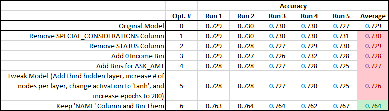

# Neural Network Charity Analysis

## Overview of Neural Network Charity Analysis
In this challenge assignment, Beks works as a data scientist for a nonprofit, philanthropic foundation called Alphabet Soup. They provide funding to organizations that protect the environment, improve peoples' well-being, and unify the world. Alphabet Soup has tasked Beks with developing a deep learning neural network model that takes in data about organizations who have applied for funding and predict whether they will be successful if funded by Alphabet Soup. She is given a [dataset](data/charity_data.csv) that contains the following information about each applying organization:

- **EIN** and **NAME**—Identification columns
- **APPLICATION_TYPE**—Alphabet Soup application type
- **AFFILIATION**—Affiliated sector of industry
- **CLASSIFICATION**—Government organization classification
- **USE_CASE**—Use case for funding
- **ORGANIZATION**—Organization type
- **STATUS**—Active status
- **INCOME_AMT**—Income classification
- **SPECIAL_CONSIDERATIONS**—Special consideration for application
- **ASK_AMT**—Funding amount requested
- **IS_SUCCESSFUL**—Was the money used effectively

The deliverables are as follows:

- **Deliverable 1: Preprocessing Data for a Neural Network Model** 
- **Deliverable 2: Compile, Train, and Evaluate the Model** 
- **Deliverable 3: Optimize the Model**

## Resources
- Data Source: [charity_data.csv](data/charity_data.csv)
- Language(s): Python
- Application(s): Jupyter Notebook
- Final Scripts: [original model](AlphabetSoupCharity.ipynb), [first optimization attempt](AlphabetSoupCharity_Optimization1.ipynb), [second optimization attempt](AlphabetSoupCharity_Optimization2.ipynb), [third optimization attempt](AlphabetSoupCharity_Optimization3.ipynb), [fourth optimization attempt](AlphabetSoupCharity_Optimization4.ipynb), [fifth optimization attempt](AlphabetSoupCharity_Optimization5.ipynb), and [sixth optimization attempt](AlphabetSoupCharity_Optimization6.ipynb)
- Model checkpoints and fully exported models can be found in the GitHub directory as well.

## Deliverable 1: Preprocessing Data for a Neural Network Model
The data were pre-processed according to the following steps:

1. Read in the `charity_data.csv` to a Pandas DataFrame, and identify the following in the dataset:
    - What variable(s) are considered the target(s) for the model?
    - What variable(s) are considered the feature(s) for the model?
2. Drop the `EIN` and `NAME` columns.
3. Determine the number of unique values for each column.
4. For those columns that have more than 10 unique values, determine the number of data points for each unique value.
5. Create a density plot to determine the distribution of the column values.
6. Use the density plot to create a cutoff point to bin "rare" categorical variables together in a new column, `Other`, and then check if the binning was successful.
7. Generate a list of categorical variables.
8. Encode categorical variables using one-hot encoding, and place the variables in a new DataFrame.
9. Merge the one-hot encoding DataFrame with the original DataFrame, and drop the originals. 
10. Split the preprocessed data into features and target arrays.
11. Split the preprocessed data into training and testing datasets.
12. Standardize numerical variables using Scikit-Learn's `StandardScaler` class, then scale the data.

## Deliverable 2: Compile, Train, and Evaluate the Model
The deep learning neural network model was compiled, trained, and evaluated according to the following steps:

1. Create a neural network model by assigning the number of input features and nodes for each layer using Tensorflow Keras.
2. Create the first hidden layer and choose an appropriate activation function.
3. If necessary, add a second hidden layer with an appropriate activation function.
4. Create an output layer with an appropriate activation function.
5. Check the structure of the model.
6. Compile and train the model.
7. Create a callback that saves the model's weights every 5 epochs.
8. Evaluate the model using the test data to determine the loss and accuracy.

The [initial model](AlphabetSoupCharity.ipynb) has an accuracy of ~72.9% and a loss of ~0.56. The accuracy needs to be improved to above 75% to be useful.

## Deliverable 3: Optimize the Model
To attempt to achieve the requisite 75% predictive accuracy, six modifications were made to the model and evaluated independently.

- [Optimization #1](AlphabetSoupCharity_Optimization1.ipynb): Remove the `SPECIAL_CONSIDERATIONS` column. The number of 'yes' responses in this column makes up <0.1% of the total values, so it was dropped.
- [Optimization #2](AlphabetSoupCharity_Optimization2.ipynb): Remove `STATUS` column. The number of '0' responses in this column makes up ~0.01% of the total values, so it was dropped.
- [Optimization #3](AlphabetSoupCharity_Optimization3.ipynb): Add '0' income bin. In the original model, all incomes of '0' were dropped for some reason after using the One-Hot Encoder. Incomes of 0 represent 71% of all values, so a separate column was added to make sure these data were included.
- [Optimization #4](AlphabetSoupCharity_Optimization4.ipynb): Add bins for `ASK_AMT`. The values in the `ASK_AMT` column varied widely from $5,000 (which made up 74% of values) up to $8.6 billion (with a B!). These values were separated into the following bins:
    - $5,000
    - $5,001 - $50,000
    - $50,001 - $500,000
    - $500,000+
- [Optimization #5](AlphabetSoupCharity_Optimization5.ipynb): Tweak the model parameters. Changes to the neural network model itself were made, including adding a third hidden layer, increasing the number of nodes per hidden layer, changing the activation type to `tanh`, and doubling the number of epochs to 200.
- [Optimization #6](AlphabetSoupCharity_Optimization6.ipynb): Keep the `NAME` column and bin it. Most organizations only apply once, but several organizations are very persistent and apply dozens, hundreds, or even over a thousand times. Their persistence in applying for funding could be a predictor of success.

## Results
### Data Preprocessing
- **What variable(s) are considered the target(s) for the model?** The target for the model is the `IS_SUCCESSFUL` column. The company wants to predict whether an organization will be successful should they be provided funding, so this column gives the historical success data to train the model.
- **What variable(s) are considered to be the features for the model?** The following variables are initially all believed to help the model predict whether an organization will be successful if funded: `APPLICATION_TYPE`, `AFFILIATION`, `CLASSIFICATION`, `USE_CASE`, `ORGANIZATION`, `STATUS`, `INCOME_AMT`, `SPECIAL_CONSIDERATIONS`, and `ASK_AMT`.
- **What variable(s) are neither targets nor features and should be removed from the input data?** The following variables are initially believed to be solely for identification and thus not useful for the model: `EIN` and `NAME`.

### Compiling, Training, and Evaluating the Model
- **How many neurons, layers, and activation functions were selected for the neural network model, and why?** The number of hidden layers was set to 2 as a starting point. The number of neurons in the first and second hidden layer were set to 2x and 1x the number of input variables, respectively. The activation functions were randomly set to `relu` as a starting point.
- **Was the model initially able to achieve the target model performance?** No, the original model was only able to achieve about 72.9% accuracy, which is 2.1% below the target.
- **What steps were taken to try and increase model performance?** The six different steps taken to attempt to optimize the model were described in Deliverable 3 above. 

## Summary
The original model and every optimization iteration were each run 5 times and then an average accuracy score was calculated. The results can be seen in the table below. None of the attempted optimizations changed the accuracy at all, except for #6. Keeping the `NAME` column and binning them to indicate how many times each organization applied turned out to be an important factor, and the accuracy increased to 76.4%.

A Random Forest model could also be used to try to predict an organization's success. Random Forest models are less prone to overfitting and less susceptible to noisy data and outliers, as well as being less computationally expensive and faster to run. A Random Forest model can also provide the relative importance of each feature to the model so that more important features can be tweaked (via binning, etc) and less important features can potentially be dropped.